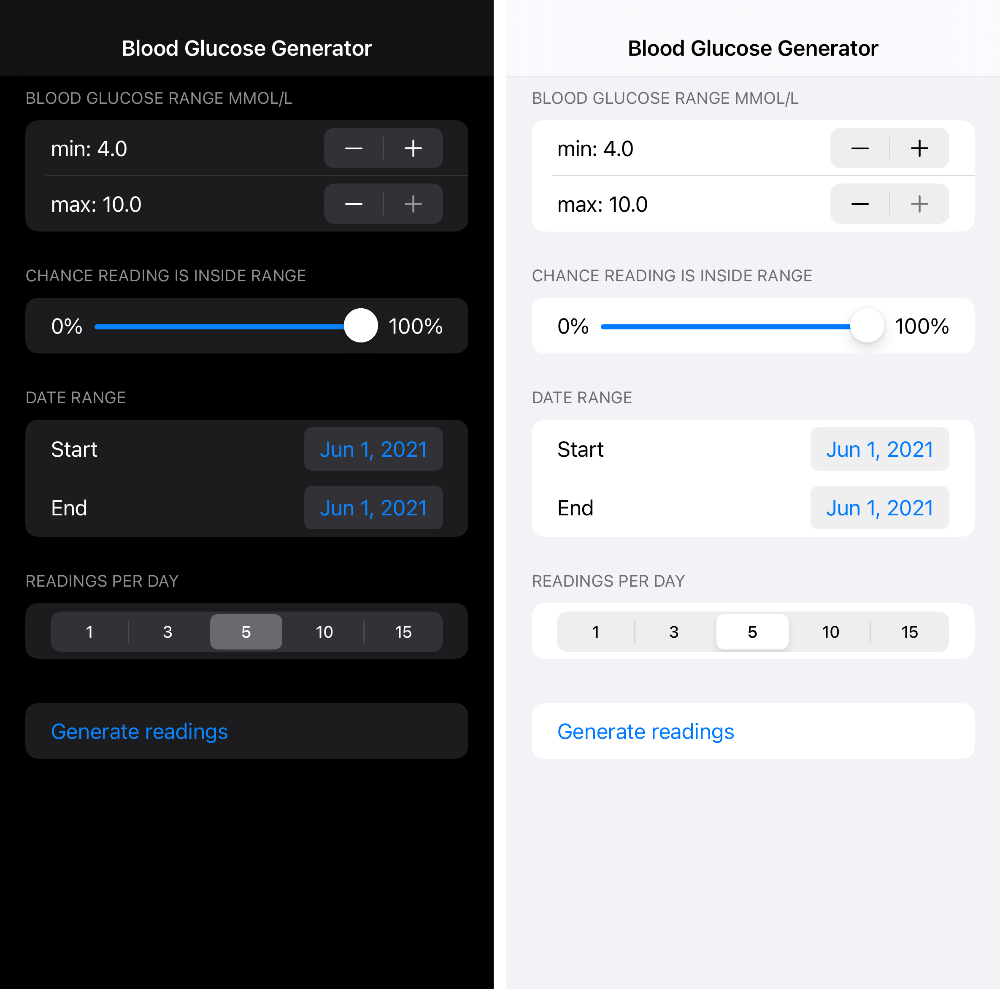

# Source code for the Blood Glucose Generator

_Blood Glucose Generator_ - SwiftUI blood glucose generator integrated with HealthKit for iOS.

You'll need Xcode 12 and at least iOS 14.5 to build & run the application. The application will ask for permission to read & write blood glucose data to HealthKit on iOS.

## Features

- Configurable range for the generated blood glucose levels, date range, probability that a reading may be outside the range.

- Background support. The application generates ten blood glucose readings each day in the background.

## Preview

